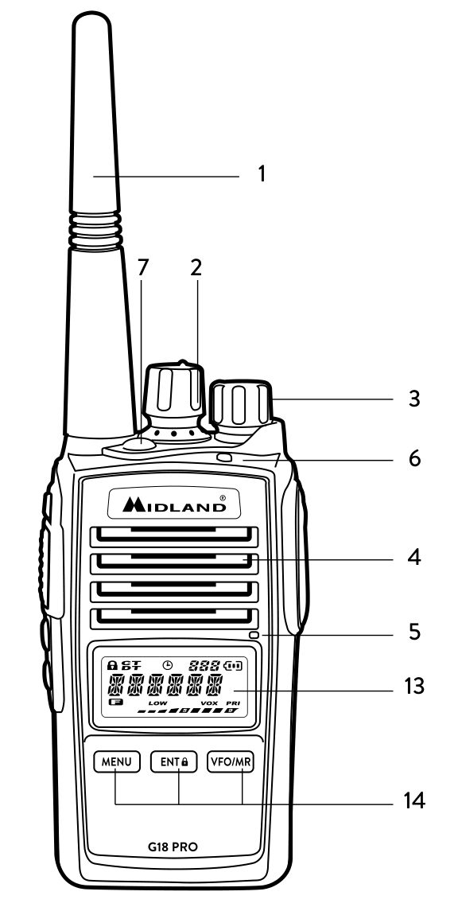
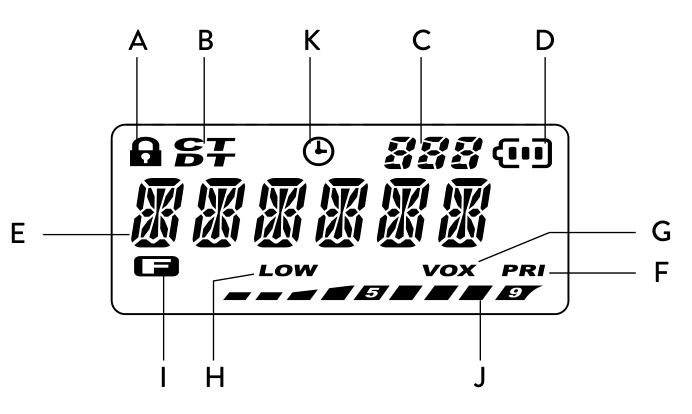
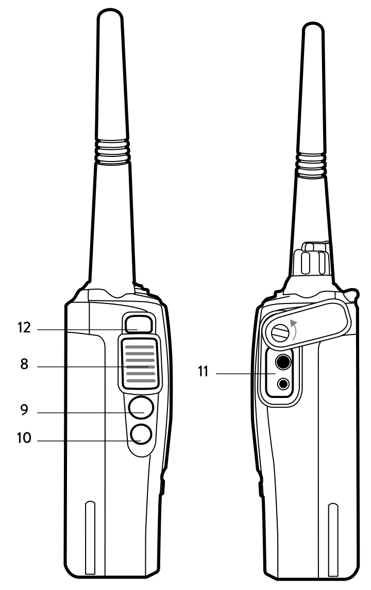

# Midland G18 PRO Instruction Guide

 

> **⚠️ UNOFFICIAL MARKDOWN VERSION**
>
> This is an **unofficial** markdown transcript for searchability and convenience.
> For the official documentation, refer to: [MANUAL_G18_PRO_EN.pdf](MANUAL_G18_PRO_EN.pdf)

**PMR446 Transceiver — Official Instruction Guide**

**Coverage**: Depending on terrain (up to 12+ km in open space)

*Coverage varies with environmental conditions.*

## Table of Contents

- [Midland G18 PRO Instruction Guide](#midland-g18-pro-instruction-guide)
  - [Table of Contents](#table-of-contents)
    - [Programming software (optional)](#programming-software-optional)
    - [What’s in the box](#whats-in-the-box)
    - [Main features](#main-features)
    - [Coverage/Range](#coveragerange)
    - [Suggestions and warnings](#suggestions-and-warnings)
  - [Main controls and parts of the radio](#main-controls-and-parts-of-the-radio)
    - [LCD Display](#lcd-display)
    - [Radio](#radio)
  - [Battery recharge](#battery-recharge)
  - [Operations](#operations)
    - [Power on/off and volume adjustment](#power-onoff-and-volume-adjustment)
    - [Transmission and reception](#transmission-and-reception)
    - [Monitor](#monitor)
    - [Roger Beep (end transmission tone)](#roger-beep-end-transmission-tone)
    - [Alarm function (Emergency)](#alarm-function-emergency)
  - [MENU functions](#menu-functions)
    - [Scan](#scan)
    - [PRI (Priority Scan)](#pri-priority-scan)
    - [VOX](#vox)
    - [POW – Setting the transmission power](#pow--setting-the-transmission-power)
    - [Squelch](#squelch)
    - [Scrambler](#scrambler)
    - [Led - Backlight](#led---backlight)
    - [Keypad Beep on/off](#keypad-beep-onoff)
    - [Keypad lock (KEYBO)](#keypad-lock-keybo)
    - [TOT- Funzione TX timeout timer](#tot--funzione-tx-timeout-timer)
    - [SCAN mode settings](#scan-mode-settings)
    - [VOICE function](#voice-function)
    - [C-CDC / R-CDC / T-CDC](#c-cdc--r-cdc--t-cdc)
    - [Name - Nome](#name---nome)
  - [Technical specifications](#technical-specifications)
    - [GENERAL](#general)
    - [TRANSMITTER](#transmitter)
    - [RECEIVER](#receiver)
  - [Troubleshooting](#troubleshooting)

*Thanks for choosing Midland! G18 PRO is a portable transceiver that is free use in all*
*European countries.*
Midland G18 PRO is the new multi-tasks PMR446 transceiver.
Its robust frame and the IP67 certification ensure a total protection from dust and
from the immersion in water up to 1mt depth for 30 minutes.
G18 PRO is the ideal solution for your free time but especially in extreme conditions that require a reliable device.

### Programming software (optional)

Thanks to Midland Programming software **PRG-G15**, it is possible to increase the
performance of your radio or to reduce its functionality by enabling or disabling
some features:

- CTCSS/DCS codes
- TOT (Timeout Timer)
- VOX sensitivity
- ROGER BEEP
- SQUELCH levels
- VOICE announcements
- RRM channel (Italy only)

For further information, please consult the Programming software manual.

> **⚠️ WARNING**: Any attempt to change frequencies or output power of the radio invalidates the approval.

### What’s in the box

- 1 G18 PRO transceiver
- 1 belt clip
- 1 wall adaptor
- 1 Li-ion da 1600mAh rechargeable battery pack
- 1 fast desktop charger

### Main features

- Extended frequency band: 446.00625 - 446.19375MHz
- 16 New PMR446 channels
- 99 PMR446 channels: 16 + 83 pre-programmed
- **IP 67 Certified** (Waterproof & Dustproof)
- 50 CTCSS tones + 105 DCS Codes
- RRM channel (only for Italy)
- Scrambler (voice encryption)
- FM Radio and Compander (programmable with PRG-G15)
- Scan, Monitor and VOX functions
- Vocal announcement

### Coverage/Range

The maximum range depends on terrain conditions and is obtained during use in an open space.

**Typical Range Performance:**

| Environment | Obstructions | Range |
|-------------|--------------|-------|
| 🏙️ **Urban/City** | Buildings, structures | **1-2 km** |
| 🌳 **Semi-Open** | Trees, houses | **4-6 km** |
| ⛰️ **Open Space** | Line of sight, mountains | **12+ km** |
| 🚗 **Inside Vehicle** | Metal enclosure | **Reduced** |

> 📡 **Range Factors**: Environmental obstacles (trees, buildings, metal structures) significantly affect transmission range.

### Suggestions and warnings

Your G18 PRO was designed to fulfill any warranty obligations and to enjoy this
product for many years.

As for all electronic devices, we recommend you to follow these suggestions:

**Important Safety Guidelines:**

- Do not attempt to open the unit. Non-expert handling may damage it and void the warranty.
- When using regulated power supply, use only 6V-8V DC to avoid damages.
- High temperatures can shorten the life of electronic devices. Do not store the radio in hot or dirty areas.
- If the radio diffuses peculiar smell or smoke, immediately shut off power and remove the charger or battery.

## Main controls and parts of the radio

### LCD Display

**Display Indicators:**

| Label | Function |
|-------|----------|
| a | Keypad lock |
| b | Selected CTCSS tone or DCS code |
| c | Number of the menu/channel indicator |
| d | Battery status indicator |
| e | Channel in use |
| f | Priority scan mode |
| g | VOX function activated |
| h | Low power indicator |
| i | Function key activated |
| j | Indicator of rx and tx signal strength |
| k | Channel temporarily not scanned |

### Radio

**Physical Controls:**

| # | Component | Description |
|---|-----------|-------------|
| 1 | Antenna | External antenna |
| 2 | Encoder | Rotate clockwise or counter-clockwise to select the different settings |
| 3 | Power/volume knob | Turn clockwise to power on and increase the volume level; turn counter-clockwise to decrease the volume level and power off |
| 4 | Speaker | Audio output |
| 5 | Built-in microphone | Microphone for transmitting |
| 6 | Led indicator | RED: TX / GREEN: RX |
| 7 | Emergency button | Can be activated through the programming software |
| 8 | PTT | Push this button to transmit, release it to receive |
| 9 | Function key 1 (PF3) | Short pressure: Monitor function activation |
| 10 | Function key 2 (PF4) | Long pressure: SCAN function activation |
| 11 | External Speaker/Mic Jack | Motorola type: allows the connection with external devices such as headsets, microphones |
| 12 | Multi-function key 'FUN' | Allows to activate secondary functions |
| 13 | LCD Display | Information display |
| 14 | Multi-function keys | MENU - ENT - VFO/MR |

## Battery recharge

G18 PRO is equipped for using a 7.4V Li-ion rechargeable battery pack (1600mAh), which can
be recharged by connecting the socket of the AC/DC wall adapter to a mains power socket and inserting the jack of the wall adapter into the desktop charger plug.

**Charging time**: 4 hours to fully recharge the radio.

**Desktop Charger LED Indicators:**

| LED Color | Status |
|-----------|--------|
| Red | Charging in progress |
| Green | Fully charged |

**Recommendations:**

- For maximum battery life, charge the battery pack when the G18 PRO is powered off and the battery is fully discharged.
- **WARNING**: Using a different battery charger than specified can cause device damage, explosions, or personal injuries.

**Battery Power Saving Feature:**

The battery power saving feature enables a reduction in consumption of up to 50% and saves the battery life. If it has been set, it automatically activates when the transceiver does not receive any signal for more than 5 seconds. Power saving can be disabled only through the Programming software.

## Operations

### Power on/off and volume adjustment

Rotate the PWR/VOL clockwise to turn the radio on.
Rotate the control clockwise /counter-clockwise to adjust the volume level as you
prefer.
To turn the radio off, rotate the control counter-clockwise till hearing a mechanical
“click”.

### Transmission and reception

To communicate, all radios in your group must be set to the same channel.
Briefly press the Function key 1 to enable the Monitor feature in order to make sure
that the frequency is not busy, then press the PTT button.
Release the PTT key to receive.
*Only one user at a time can talk during radio communications. Therefore, it is important*
*not to transmit when you are receiving a communication and use the transmission mode*
*sparingly to allow other users to talk.*
*Transmission consumes a significant amount of energy and should therefore be used*
*sparingly to prolong the battery life.*
*If you are unable to contact a station that you have no problems in receiving, the station*
*may be using CTCSS tones or DCS codes.*

### Monitor

The Monitor feature is for excluding (opening) the Squelch, in order to listen to
signals that are too weak to keep the Squelch permanently opened.
Press briefly the Function key 1 to enable such function.

### Roger Beep (end transmission tone)

When the PTT button is released, the radio will beep to confirm to other users that
you’ve finished your transmission and that they can start talking.
Roger Beep is disabled by default and can be activated through the programming
software.

### Alarm function (Emergency)

By pressing the Emergency button, the radio will switch to Alarm Emergency
mode.
G18 PRO will switch to transmission for 30 seconds by generating a sound alarm,
then for further 30 seconds will remain in tx to allow the user to communicate his
status.
At the end, the radio will switch to reception.
If needed, the Emergency call can be repeated.
*Note: this function can be activated through the optional programming software.*

## MENU functions

Here below is a list of the default functions that you will find in the menu of this
radio.
First of all, you have to push the MENU button to enter and find the desired function.

### Scan

This function is enabled by pushing the Function key 2 for 3 seconds; you will see
the channels scanning on the display of the radio.
Whenever any signal is detected, the scanning will stop on a busy channel.
As soon as the signal is no longer detected, the scan will start after 5 seconds.
If you press the PTT, the radio will transmit on the latest busy channel; after about
5 seconds that you released the PTT, the scanning will be active.

### PRI (Priority Scan)

When you activate this function, the radio will alternately scan the standard channels and the priority one. The priority channel can be selected only with the programming software. The default priority channel is CH1.

### VOX

The VOX feature enables hands free conversations without using PTT: just speak
in the direction of the microphone and the communication will be automatically
activated.
The VOX sensitivity can be adjusted in 10 different levels (0,1,2,3…9) through the
Menu or programming software :
OFF means that the VOX is turned off, level 1 is set by default and has the lowest
VOX sensitivity, 9 is the highest one.
To activate the VOX levels, follow these steps:

1. Press the MENU button;
2. Turn the Encoder knob until the display shows “VOX”;
3. Press the ENT key;
4. Turn again the Encoder knob and select the desired VOX level: 1= low sensitivity; 9= highest sensitivity.
5. Confirm your selection with the ENT key.

### POW – Setting the transmission power

G18 PRO has 2 power levels.
To select the desired level:

1. Press the MENU button;
2. Rotate the Encoder knob till the display shows “POW”;
3. Press ENT;
4. Rotate the encoder knob and select the desired power level;
5. Press ENT to confirm. If you selected the low power, the display will show
“LOW”
By default, both low and high power are set at 500mW.

### Squelch

The Squelch function suppresses noises on free channels and allows to receive even
weak signals.
G18 PRO has 10 (0-9) different Squelch levels that can be set by programming
software or Menu:
0 means that the Squelch is turned off; from level 1 to level 9 you will have different
levels of noise reduction. The higher is the level, the louder will be the Squelch.
By default, the Squelch level is set on level 5.
To select the Squelch level:

1. Press the MENU button;
2. Turn the Encoder knob until “SQL” is displayed;
3. Press the ENT button;
4. Turn the Encoder knob and select the desired Squelch level (the levels available are 10);
5. Confirm your selection with ENT.
Make sure you do not set an excessively high squelch level because in this case you
may not be able to receive weaker signals. On the other hand an excessively low
Squelch value could enable the Squelch even when no signals are present.
Squelch must always be adjusted when no signals are present.

### Scrambler

The scrambler is designed to protect communications.
This feature prevents parties from other networks from hearing and understanding
voice communications.
To enable/disable the scrambler:

1. Press the MENU button;
2. Turn the Encoder knob until “SCRM” is displayed;
3. Push ENT to enter the function;
4. Turn the Encoder knob to activate/deactivate the SCRAMBLER: “ON” (to
activate it), or “OFF” (to deactivate it);
5. Confirm your selection with ENT.
When the scrambler is enabled, it is not possible to clearly receive communications.
Therefore, before enabling it, it is necessary to make sure that all the radios you
wish to communicate with have enabled this feature, otherwise you won’t be able
to talk with them.
The scrambler of the transceiver does not fully guarantee the safety of communications.

### Led - Backlight

To enable/disable the LCD backlight:

1. Press the MENU button;
2. Turn the Encoder knob until “LED” is displayed;
3. Push ENT to enter the function;
4. Turn the Encoder knob to activate/deactivate the Backlight.
There are 3 available options: “ON”, “OFF” and “AUTO”.
AUTO: the display backlight activates when you press any key and lasts a few
seconds.
OFF: back light off.
ON: backlight always on. Attention: in this mode the power save is off,
therefore the battery consumption will increase.
5. Confirm your selection with ENT.

### Keypad Beep on/off

Every time a button is pressed, you will hear a Beep tone. The keypad beep tone is
activated by default.
To disable the beeps, follow this procedure:

1. Press the MENU button;
2. Turn the Encoder knob until “BEEP” is displayed;
3. Push ENT to enter the function;
4. Turn the Encoder knob to activate/deactivate the Beep tones: “ON” (to activate it), or “OFF” (to deactivate it);
5. Confirm your selection with ENT.

### Keypad lock (KEYBO)

It is possible to choose between two types of Lock Mode:

1. Press the MENU button;
2. Turn the Encoder knob until “KEYBO” is displayed;
3. Push ENT to enter the function;
4. Turn the Encoder knob and choose between “MANUAL” or ”AUTO”.
5. Confirm your selection with ENT.
As previously mentioned, there are two ways to lock the keypad:
“MANUAL”: to lock the keypad, simply press FUN and ENT keys for 3 seconds.
will be displayed.
“AUTO”: the keypad will be automatically locked after 20 seconds. To unlock the
radio, press FUN and ENT keys.

### TOT- Funzione TX timeout timer

G18 PRO can be programmed with a transmission timer that temporarily blocks
transmissions if the radio has been used beyond the maximum time permitted.
The radio is forced in reception mode if it continues transmitting after the preset
timer threshold has been reached.
To restart the transmission, release the PTT key.
To enable this function:

1. Press the MENU button;
2. Turn the Encoder knob until “TOT” is displayed;
3. Push ENT to enter the function;
4. Turn the Encoder knob and set a timer from 30 to 270 seconds.
5. Confirm your selection with ENT.

### SCAN mode settings

Press MENU and then rotate the Encoder knob. The display will show “SCANS”.
Press ENTER and then rotate the Encoder knob to choose the type of Scan (TO/
CO/SE).
Confirm your selection with ENT.
TO - Time-operated Scan
Whenever a signal is detected, the radio will suspend the scan for 5 seconds, and
then will continue to scan even if the signal is still present.
CO: Carrier-operated Scan
Whenever a signal is detected, the radio will stop scanning. It will resume to scan
once the signal will disappear.
SE: Search Scan
The radio will stop scanning and exit the Scan mode once detected a signal.
It is possible to exclude some channels from the scan list. Follow these steps:

- select the channel to exclude from the scan list
- keep pressed ENT for 4 seconds
- the display will show
- to add the channel into the scan list again, follow the same procedure.

### VOICE function

With this function, you activate a voice that informs you about any operation/selection you are doing.
To activate it, follow these steps:

1. Press the MENU button;
2. Turn the Encoder knob until “VOICE” is displayed;
3. Push ENT to enter the function;
4. Turn the Encoder knob to activate/deactivate the function: “ON” (to activate
it), or “OFF” (to deactivate it);
5. Confirm your selection with ENT.

### C-CDC / R-CDC / T-CDC

The CTCSS tones can be added to the channels for creating new private channels.
They are similar to access codes and enable the radio to communicate only with the
users that are tuned on the same channel and have set the same code. For each
channel you can set up to 50 CTCSS tones and 105 DCS codes.
To select a CTCSS tone:

1. Press the MENU button;
2. Turn the Encoder knob till “C-CDC”(in TX and RX); “R-CDC”(only in RX) or
“T-CDC” (only in TX) appears on the display;
3. Push ENT to enter the function;
4. Turn the Encoder knob and select the desired CTCSS tone
5. To confirm, press the ENT button.
*The setting of a CTCSS tone disables all DCS codes, because these functions cannot be*
*used simultaneously.*
If you want to use and select a DCS code, instead of a CTCSS tone, follow these steps:
1. Press the MENU button;
2. Turn the Encoder knob till: “C-CDC”(in TX and RX); “R-CDC”(only in RX) or
“T-CDC” (only in TX) appears on the display;
3. Push ENT to enter the function;
4. Press the Function key 1;
5. Turn the Encoder knob and select the desired DCS code;
6. Confirm the selection by pressing the ENT button.
*The setting of a DCS code disables all CTCSS tones, because these functions cannot be*
*used simultaneously.*

### Name - Nome

It is possible to choose and set a name that will appear on the display instead of the
channel number.

## Technical specifications

### GENERAL

| Parameter | Specification |
|-----------|---------------|
| Frequency range | 446.00625- 446.19375 MHz (PMR446) |
| Channels | 16+83 pre-set |
| Working temperature | -20°+55° |
| Operating voltage | 7.4V |
| Operative Mode | Simplex |
| Dimensions | 113mm×56mm×38mm (Antenna excluded) |
| Weight | 240g (Battery included) |
| Impedance | Antenna 50Ω |
| Duty cycle | 5/5/90% |

### TRANSMITTER

| Parameter | Specification |
|-----------|---------------|
| Frequency stability | ±2.5PPM |
| Output power | ≤500mW ERP |
| Max frequency deviation | ≤2,5KHz |
| Audio distortion | ≤3% |
| Adjacent channel power | < 60 dB |
| Spurious radiation | Within European legal terms |
| Occupied bandwidth | Within European legal terms |

### RECEIVER

| Parameter | Specification |
|-----------|---------------|
| RF sensitivity | <0.2UV@20 dB SINAD |
| Audio distortion | ≤3% |
| Audio response | 300Hz ÷ 3KHz |
| Adjacent channel selectivity | Within European legal terms |
| Intermodulation rejection | Within European legal terms |
| Spurious emissions | Within European legal terms |
| Blocking | Within European legal terms |
| SAR | 0,982W/Kg |

*WARNING: Direct plug-in ac/dc power supply must be used for disconnecting  
the transceiver from the mains; the desktop charger must be positioned close  
to the unit and easily accessible.*

## Troubleshooting

| Problem | Possible Cause | Solution |
|---------|----------------|----------|
| The radio doesn't switch on | The battery pack is discharged and/or has not been installed correctly. | Verify that the battery pack is charged and that it has been correctly installed. |
| The radio switches off shortly after it has been switched on | Discharged battery pack. | Recharge the battery pack. |
| The battery pack does not recharge | The battery-charger has not been connected or installed correctly. | Inspect the connections of the battery-charger and the installation of the batteries. |
| The radio switches on but is unable to receive signals | The site of installation is too shielded. | Move to an another area. |
| The radio switches on but is unable to receive signals | The volume is too low | Adjust the volume level. |
| The radio switches on but is unable to receive signals | Incorrect CTCSS or DCS | Check that the CTCSS tone or DCS code corresponds to the one set by the parties you are communicating with. |
| It is not possible to communicate with other parties | An incorrect radio channel has been selected. | Select the same radio channel used by the parties you are communicating with. |
| It is not possible to communicate with other parties | The radio is installed in a shielded area or is too far from the party you are communicating with | Move to another area. |
| It is not possible to communicate with other parties | Incorrect CTCSS or DCS | Check that the CTCSS tone or DCS code corresponds to the one set by the parties you are communicating with. |
| Reception is fragmented and/or disturbed | The signal is very weak. | Try temporarily to disable the Squelch by means of the Monitor feature. |
| Reception is fragmented and/or disturbed | The transmission distance is excessive and/or there are obstacles in the transmission path | Move closer to the party you are communicating with or to another area. |
| Reception is fragmented and/or disturbed | Other parties are using the same channel | Check the traffic on the radio channel by means of the Monitor feature and select another channel if required. |
| Reception is fragmented and/or disturbed | The radio has been installed too close to equipment that causes interference (televisions, computers, etc.) | Increase the distance between the radio and this equipment. |
| The autonomy of the battery pack is limited | Transmission time is too long. | Try to reduce the transmission time and/or use a low power. |

---

**Prodotto o importato da**  
MIDLAND EUROPE S.r.l.
Via R.Sevardi 7 - 42124 Reggio Emilia - Italia
<www.midlandeurope.com>  
Prima dell’uso leggere attentamente le istruzioni.

**Produced or imported by:**  
MIDLAND EUROPE S.r.l.
Via R.Sevardi 7 - 42124 Reggio Emilia - Italy
<www.midlandeurope.com>

**Imported by:**  
ALAN-NEVADA UK
Unit 1 Fitzherbert Spur Farlington Portsmouth Hants P06 1TT - United Kingdom
<www.nevada.co.uk>  
Read the instructions carefully before installation and use.

**Vertrieb durch:**  
ALAN ELECTRONICS GmbH
Daimlerstraße 1g - D-63303 Dreieich - Deutschland
<www.alan-electronics.de>  
Vor Benutzung Bedienungsanleitung beachten.

**Importado por:**  
MIDLAND IBERIA, SA.
C/Cobalt, 48 - 08940 Cornellà De Llobregat, Barcelona - España
<www.midland.es>  
Antes de utilizar, lea atentamente el manual de uso.

**Importé par:**  
ALAN FRANCE S.A.R.L.
10 impasse Phytagore, 13127 Vitrolles - France
<www.alan-midland.fr>  
Avant l’utilisation, lire les instructions.
